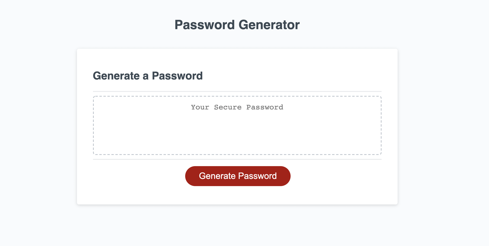

# 03_homwork_password
This homework was to create a password generator using JavaScript.
  I am having trouble with the for loop to make a password that is the length of the input from the first prompt 
  If I cannot solve this by the time of grading I will more than likely need to re-submit for a better grade 
  A link the website https://jminaga.github.io/03_homwork_password/Develop/index.html  

